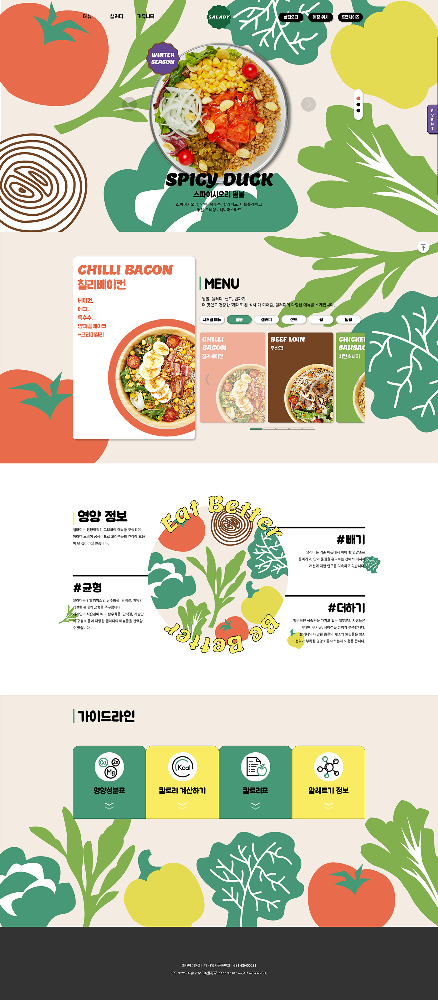

# publising_salady
샐러디 웹 리디자인 (메인 페이지)

웹사이트 https://aewols.github.io/publising_salady/
 비핸스 https://www.behance.net/gallery/156230621/2021-Web-Design-Salady-

 

## 이미지

 

## 소개
### About 샐러디

샐러디는 '음식을 통해 사람들의 삶을 즐겁고 건강하게 만든다'는
 브랜드 미션을 가진 샐러드 전문점입니다. 샐러디는 웜볼, 랩, 샌드 등
 더욱 다양한 메뉴군과 함께 샐러드 전문점을 넘어 건강한 패스트푸드로
 도약하고자 합니다.

 

## 수행 내용
### 메인 페이지 제작 - HTML, CSS, jQuery를 이용한 UI 구현

* 레이아웃은 HTML5 시멘틱 태그로 구성
* jQuery를 활용한 탑 네비게이션 메뉴와 비주얼 슬라이드 효과 구현 
* 이미지 또는 배너는 마우스 오버시 효과를 트렌지션 효과를 사용하여 구현
* 접근성과 편리성을 위한 웹 표준 준수
* 주요 브라우저에서 레이아웃이 호환 가능(크로스브라우징)
